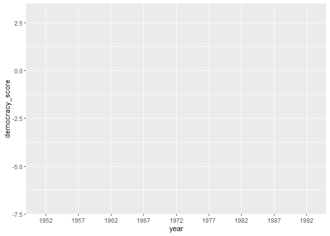
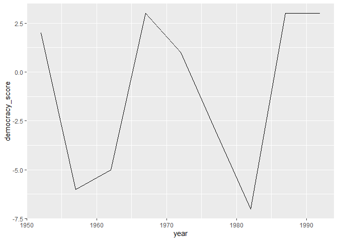

Week8 DAS
================
2023-03-03

    ## # A tibble: 193 × 5
    ##    country           beer_servings spirit_servings wine_servings total_litres_…¹
    ##    <chr>                     <int>           <int>         <int>           <dbl>
    ##  1 Afghanistan                   0               0             0             0  
    ##  2 Albania                      89             132            54             4.9
    ##  3 Algeria                      25               0            14             0.7
    ##  4 Andorra                     245             138           312            12.4
    ##  5 Angola                      217              57            45             5.9
    ##  6 Antigua & Barbuda           102             128            45             4.9
    ##  7 Argentina                   193              25           221             8.3
    ##  8 Armenia                      21             179            11             3.8
    ##  9 Australia                   261              72           212            10.4
    ## 10 Austria                     279              75           191             9.7
    ## # … with 183 more rows, and abbreviated variable name
    ## #   ¹​total_litres_of_pure_alcohol

    ## [1] 336776     19

    ## # A tibble: 6 × 19
    ##    year month   day dep_time sched_dep…¹ dep_d…² arr_t…³ sched…⁴ arr_d…⁵ carrier
    ##   <int> <int> <int>    <int>       <int>   <dbl>   <int>   <int>   <dbl> <chr>  
    ## 1  2013     1     1      517         515       2     830     819      11 UA     
    ## 2  2013     1     1      533         529       4     850     830      20 UA     
    ## 3  2013     1     1      542         540       2     923     850      33 AA     
    ## 4  2013     1     1      544         545      -1    1004    1022     -18 B6     
    ## 5  2013     1     1      554         600      -6     812     837     -25 DL     
    ## 6  2013     1     1      554         558      -4     740     728      12 UA     
    ## # … with 9 more variables: flight <int>, tailnum <chr>, origin <chr>,
    ## #   dest <chr>, air_time <dbl>, distance <dbl>, hour <dbl>, minute <dbl>,
    ## #   time_hour <dttm>, and abbreviated variable names ¹​sched_dep_time,
    ## #   ²​dep_delay, ³​arr_time, ⁴​sched_arr_time, ⁵​arr_delay

    ## Rows: 336,776
    ## Columns: 19
    ## $ year           <int> 2013, 2013, 2013, 2013, 2013, 2013, 2013, 2013, 2013, 2…
    ## $ month          <int> 1, 1, 1, 1, 1, 1, 1, 1, 1, 1, 1, 1, 1, 1, 1, 1, 1, 1, 1…
    ## $ day            <int> 1, 1, 1, 1, 1, 1, 1, 1, 1, 1, 1, 1, 1, 1, 1, 1, 1, 1, 1…
    ## $ dep_time       <int> 517, 533, 542, 544, 554, 554, 555, 557, 557, 558, 558, …
    ## $ sched_dep_time <int> 515, 529, 540, 545, 600, 558, 600, 600, 600, 600, 600, …
    ## $ dep_delay      <dbl> 2, 4, 2, -1, -6, -4, -5, -3, -3, -2, -2, -2, -2, -2, -1…
    ## $ arr_time       <int> 830, 850, 923, 1004, 812, 740, 913, 709, 838, 753, 849,…
    ## $ sched_arr_time <int> 819, 830, 850, 1022, 837, 728, 854, 723, 846, 745, 851,…
    ## $ arr_delay      <dbl> 11, 20, 33, -18, -25, 12, 19, -14, -8, 8, -2, -3, 7, -1…
    ## $ carrier        <chr> "UA", "UA", "AA", "B6", "DL", "UA", "B6", "EV", "B6", "…
    ## $ flight         <int> 1545, 1714, 1141, 725, 461, 1696, 507, 5708, 79, 301, 4…
    ## $ tailnum        <chr> "N14228", "N24211", "N619AA", "N804JB", "N668DN", "N394…
    ## $ origin         <chr> "EWR", "LGA", "JFK", "JFK", "LGA", "EWR", "EWR", "LGA",…
    ## $ dest           <chr> "IAH", "IAH", "MIA", "BQN", "ATL", "ORD", "FLL", "IAD",…
    ## $ air_time       <dbl> 227, 227, 160, 183, 116, 150, 158, 53, 140, 138, 149, 1…
    ## $ distance       <dbl> 1400, 1416, 1089, 1576, 762, 719, 1065, 229, 944, 733, …
    ## $ hour           <dbl> 5, 5, 5, 5, 6, 5, 6, 6, 6, 6, 6, 6, 6, 6, 6, 5, 6, 6, 6…
    ## $ minute         <dbl> 15, 29, 40, 45, 0, 58, 0, 0, 0, 0, 0, 0, 0, 0, 0, 59, 0…
    ## $ time_hour      <dttm> 2013-01-01 05:00:00, 2013-01-01 05:00:00, 2013-01-01 0…

    ## Rows: 16
    ## Columns: 2
    ## $ carrier <chr> "9E", "AA", "AS", "B6", "DL", "EV", "F9", "FL", "HA", "MQ", "O…
    ## $ name    <chr> "Endeavor Air Inc.", "American Airlines Inc.", "Alaska Airline…

    ## [1] 3322    9

    ## [1] "tailnum"      "year"         "type"         "manufacturer" "model"       
    ## [6] "engines"      "seats"        "speed"        "engine"

    ## [1] 26115    15

    ##  [1] "origin"     "year"       "month"      "day"        "hour"      
    ##  [6] "temp"       "dewp"       "humid"      "wind_dir"   "wind_speed"
    ## [11] "wind_gust"  "precip"     "pressure"   "visib"      "time_hour"

    ## [1] 1458    8

    ## [1] "faa"   "name"  "lat"   "lon"   "alt"   "tz"    "dst"   "tzone"

    ## Rows: 1,458
    ## Columns: 8
    ## $ faa   <chr> "04G", "06A", "06C", "06N", "09J", "0A9", "0G6", "0G7", "0P2", "…
    ## $ name  <chr> "Lansdowne Airport", "Moton Field Municipal Airport", "Schaumbur…
    ## $ lat   <dbl> 41.13047, 32.46057, 41.98934, 41.43191, 31.07447, 36.37122, 41.4…
    ## $ lon   <dbl> -80.61958, -85.68003, -88.10124, -74.39156, -81.42778, -82.17342…
    ## $ alt   <dbl> 1044, 264, 801, 523, 11, 1593, 730, 492, 1000, 108, 409, 875, 10…
    ## $ tz    <dbl> -5, -6, -6, -5, -5, -5, -5, -5, -5, -8, -5, -6, -5, -5, -5, -5, …
    ## $ dst   <chr> "A", "A", "A", "A", "A", "A", "A", "A", "U", "A", "A", "U", "A",…
    ## $ tzone <chr> "America/New_York", "America/Chicago", "America/Chicago", "Ameri…

    ## Rows: 96 Columns: 10
    ## ── Column specification ────────────────────────────────────────────────────────
    ## Delimiter: ","
    ## chr (1): country
    ## dbl (9): 1952, 1957, 1962, 1967, 1972, 1977, 1982, 1987, 1992
    ## 
    ## ℹ Use `spec()` to retrieve the full column specification for this data.
    ## ℹ Specify the column types or set `show_col_types = FALSE` to quiet this message.

    ## # A tibble: 9 × 3
    ##   country   year  democracy_score
    ##   <chr>     <chr>           <dbl>
    ## 1 Guatemala 1952                2
    ## 2 Guatemala 1957               -6
    ## 3 Guatemala 1962               -5
    ## 4 Guatemala 1967                3
    ## 5 Guatemala 1972                1
    ## 6 Guatemala 1977               -3
    ## 7 Guatemala 1982               -7
    ## 8 Guatemala 1987                3
    ## 9 Guatemala 1992                3

    ## `geom_line()`: Each group consists of only one observation.
    ## ℹ Do you need to adjust the group aesthetic?

<!-- --><!-- -->

    ## # A tibble: 6 × 3
    ##   country    year  democracy_score
    ##   <chr>      <chr>           <dbl>
    ## 1 Albania    1952               -9
    ## 2 Argentina  1952               -9
    ## 3 Armenia    1952               -9
    ## 4 Australia  1952               10
    ## 5 Austria    1952               10
    ## 6 Azerbaijan 1952               -9

    ## Rows: 202 Columns: 67
    ## ── Column specification ────────────────────────────────────────────────────────
    ## Delimiter: ","
    ## chr  (1): country
    ## dbl (66): 1951, 1952, 1953, 1954, 1955, 1956, 1957, 1958, 1959, 1960, 1961, ...
    ## 
    ## ℹ Use `spec()` to retrieve the full column specification for this data.
    ## ℹ Specify the column types or set `show_col_types = FALSE` to quiet this message.

    ## # A tibble: 6 × 3
    ##   country             year  life_exp
    ##   <chr>               <chr>    <dbl>
    ## 1 Afghanistan         1951      27.1
    ## 2 Albania             1951      54.7
    ## 3 Algeria             1951      43.0
    ## 4 Angola              1951      31.0
    ## 5 Antigua and Barbuda 1951      58.3
    ## 6 Argentina           1951      61.9
